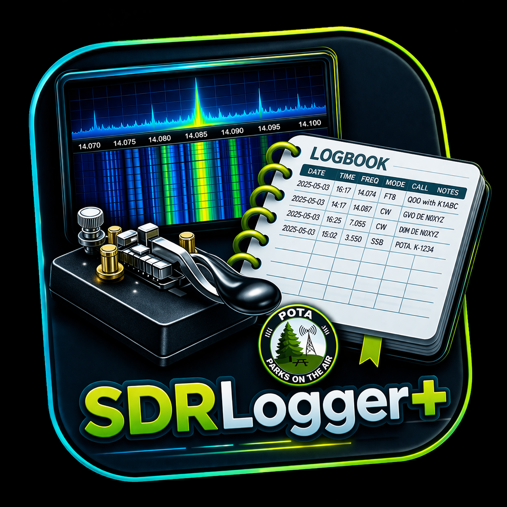

  

  # SDR**Logger+**
  ### Ham Radio SDR Logbook — Built by Hams, for Hams

  
  
  
  
  

  **[⬇ Download Latest Release](#-download) · [📖 Quick Start Guide](#-quick-start) · [💬 Join on Fluxer](https://fluxer.gg/7UNSp5nW)**

---

## Overview

SDRLogger+ is a next-generation, browser-based Ham Radio contact logger engineered for operators running TCI (Transceiver Control Interface®) by Expert Electronics — SDR applications such as the popular EESDR and Thetis SDR — or any HamLib-compatible radio. **Now with full satellite operating support** via the CSN Technologies S.A.T. controller, a complete Awards Dashboard tracking DXCC / WAS / WAZ / WPX / VUCC / 5BWAS / 5BDXCC / WAC, a live Statistics Dashboard, and a Feeds & Alerts page wired to the WA7BNM contest calendar and NG3K DXpedition announcements. Log contacts, work DX, work satellites, decode CW, control your rotator, and upload QSOs to every major service — all from a single, stunning interface.

---

## 🆕 What's New in v1.10

> **SAT map footprint accuracy fix** — the yellow coverage circle on the Satellite map was rendering ~2× too large across every bird because we were treating the CSN S.A.T. controller's `satFootprint` value as a radius when it's actually the DIAMETER (inheriting the predict/Gpredict convention). Rewrote the sizing math to compute the radius directly from satellite altitude using the 0° geometric-horizon formula `r = R · acos(R / (R + h))`, so our circle now matches the S.A.T. controller's own MAP panel. Validated against live SO-50 telemetry: alt 605.9 km → 2,679 km radius, matching CSN's reported diameter 5,352.8 km to 0.1%. All v1.09-rc2 / rc1 features below roll forward unchanged.

---

## 🆕 What's New in v1.09-rc2

> **Polish release** — three font-scale buttons (A · A · A+) on `/awards`, `/stats`, and `/feeds`; brighter/larger 🔥 Hot List status banner with inline ✕ Clear-All on `/feeds` AND on Settings → Display; smarter Feeds callsign extractor that now ignores band tokens (`10M`, `12M`, `70CM`), power tokens (`50W`, `100W`, `1KW`), and Maidenhead grid squares (`QL64XG`); cross-tab live sync hardening for the Hot List via `BroadcastChannel`. All v1.09-rc1 features below remain.

---

## 🆕 What's New in v1.09-rc1

> **Backup + Awards + Stats + Live Feeds Release** — scheduled auto-backup with retention, FOUR new award trackers (VUCC, 5BWAS, 5BDXCC, WAC), brand-new Statistics Dashboard with six interactive charts, brand-new Feeds & Alerts page with live contest calendar and DXpedition announcements (click any DXpedition callsign to add it instantly to your Hot List!), gray-line day/night terminator on the map, station metadata fields driving an expanded CW macro token system, and the 60-minute idle timeout from v1.08.2-beta rolled forward.

- 💾 **Scheduled Auto-Backup** — Settings → Backup & Restore. Daily / Weekly / On-Exit intervals; rolling "keep last N" retention with safe-prune (a failed write never destroys prior backups); each run bundles raw .db copies AND ADIF exports for both General and POTA databases into one timestamped folder. Schedule persists across restarts — closing and reopening within 24 h will NOT retrigger a Daily backup.
- 🏆 **VUCC Tracker** — unique 4-character Maidenhead grids per band, 6 m through 3 cm. ARRL thresholds built in (100 / 100 / 50 / 50 / 25 / 25 / 10…). Per-band progress bars + detail pane listing every worked grid.
- 🏆 **5BWAS Tracker** — all-50-states count on each of 80 / 40 / 20 / 15 / 10. Gold-achieved banner when every band hits 50. Includes a full State × Band matrix so every open slot is visible at a glance.
- 🏆 **5BDXCC Tracker** — DXCC entity count per band on the same five HF bands, 100-entity threshold per band.
- 🏆 **WAC Tracker** — Worked All Continents. Six standard continents (NA / SA / EU / AS / AF / OC) plus a separate Antarctica endorsement card. Per-continent worked-bands display with sample entity names.
- 📊 **Statistics Dashboard** (`/stats`) — six Chart.js visualizations: QSOs/year bar, by-band donut, by-mode donut, top-10 entities horizontal bar, cumulative-over-time filled line, and a 24-cell hour-of-day activity heatmap. Source toggle (General / POTA / Combined), date-range filter (All / This Year / Last 12 Mo / Custom), and optional mode filter.
- 📡 **Feeds & Alerts** (`/feeds`) — Two live tabs:
  - 🏆 **Contests** — WA7BNM Contest Calendar via iCal feed. Cards show UTC + Local times, "● LIVE NOW" / "⚡ Starts within 24 h" badges, and a time-window filter (now / 48 h / weekend / 7 d / all).
  - 🌍 **DXpeditions** — NG3K Announced DX Operations via RSS. **Click any callsign chip to add it to your 🔥 Hot List instantly** — works across multi-op DXpeditions with a "+ All" convenience button. Live-syncs to the running main logger via BroadcastChannel.
  - 30-min in-memory cache with stale-data fallback when sources are unreachable. Status banner reads your existing Hot List enable / TTS settings.
- 🎙 **Station Metadata + Expanded CW Macros** — five new free-text Station fields (Rig, Antenna, Power, State, County) used SOLELY as the source for CW keyer macro tokens. Token vocabulary expanded from 4 → 12: `{MYCALL} {MYNAME} {MYGRID} {MYRIG} {MYANT} {MYPWR} {MYSTATE} {MYCNTY} {CALL} {NAME} {RST} {NR}`. Power can be "100W" or "1KW" — sent verbatim. NOT stored per-QSO and NOT written to ADIF.
- 🌓 **Gray Line Overlay** — optional day/night terminator + night-side shading on the General/POTA distance map, auto-recomputed every minute. Per-basemap styling so it reads cleanly on Voyager / Positron / Dark Matter. Off by default; toggle in Settings → Station & Rig.
- 💨 **Weather Alerts Tab (from v1.08.2-beta)** — High Wind Alerts promoted to its own Settings tab alongside Lightning Detection. Three data sources (NWS alerts, NWS METAR, Ambient PWS), three-tier 💨 banner.
- ⏱ **60-Minute Idle Timeout (from v1.08.2-beta)** — walk-aways, PC sleep, and Chrome background-throttling no longer kill the app; explicit browser-close still shuts down in ~10 s via sendBeacon.
- 📡 **ARCO Rotator Interface (from v1.08.1-beta)** — rolled forward.

### v1.08 features (rolled forward)

- 🗺 **Distance Map Style Picker** — Settings → Station & Rig → choose between **Voyager** (bright color borders, default), **Positron** (very light minimalist), or **Dark Matter** (dark theme with brightness boost) for the General/POTA distance map. Hot-swaps in place — no reload, no impact on distance/bearing/marker math.
- 🛰 **SAT Map Accuracy Pass** — switched to standard Web Mercator + CartoDB Dark Matter tiles for pixel-perfect station-marker alignment, footprint prefers the controller's own value with 5°-elevation geodesic-polygon fallback, satellite-name label refreshes when the tracked bird changes, station marker always honors your typed grid square, and marker tooltip shows source + computed lat/lon for at-a-glance verification.
- 🛰 **RBN Band Filter Fix** — band-opening alerts respect live Settings checkboxes immediately on save.

### v1.07 features (rolled forward)

- 📡 **VOACAP Propagation Chip** — inline chip in the QSO entry panel's Entity info line. Click to open a full-page propagation forecast popup for the current callsign (auto-resolves grid via QRZ/HamQTH). Hidden automatically in 🛰 SAT mode.
- 📊 **Band-by-Band Forecast** — per-path reliability % and estimated SNR (dB) for every ham band from 160 m to 6 m, with a 24-hour UTC chart showing predicted openings across the day.
- 🔬 **Real Link-Budget Math** — EIRP from your TX power + antenna gain, per-hop free-space + ionospheric loss, CCIR Rec P.372 atmospheric / man-made noise model by environment, K-index penalty, auroral absorption on polar paths, summer sporadic E boost, optional long-path mode.
- ⚙ **Propagation Settings Tab** — TX power (W), TX / RX antenna gain (dBi), noise environment (quiet → city), sporadic-E enable, long-path toggle, chip on/off. All math runs client-side in the popup — **no impact on TCI / SAT / cluster / solar pollers.**
- 🔗 **Returns to voacap.com** — self-labeled as SDRLogger+'s own simplified estimate; big CTA links out to voacap.com for authoritative predictions with the real ITS Fortran engine.
- ← **Return to SDRLogger+** button in popup header — closes the forecast and re-focuses the main window (no new tab spawned).

### v1.06.1 features (rolled forward)

- 🛰 **Satellite Map Panel** — full-globe map that auto-swaps in for the Distance Map when you enter SAT mode. Live yellow-diamond sub-point, geodesic footprint coverage polygon, beam line, and ~3-orbit SGP4 ground track propagated from Celestrak TLEs
- 🧭 **Per-Mode Dock Layouts** — General, POTA, and SAT each remember their own panel arrangement independently
- 🎨 **Panadapter Spot Coloring** — category-based colors (Needed Entity / New Band / New Mode / Standard / Hot List), all five configurable
- 🎨 **Mode Toggle Bump** — bigger, more legible General / POTA / SAT toggle with a 📓 notepad icon on General
- 🔧 **QRZ Button Behavior** — radio choice: in-app popup or open QRZ.com in a browser tab
- 🔧 **Spothole "All sources" fix** — no longer silently reverts to "DX Cluster only" on save

### v1.06 features

- ⚡ Faster SAT QSO Push — /adif background poller bypasses firmware UDP delay (<3s arrival)
- 🛰 Mode-Gated SAT Listeners — UDP ports 1100/9932 only opened while in 🛰 SAT mode
- 🧹 Smart SAT Dedup + 🧹 Dedupe button for legacy cleanup
- ⚡ In-memory dedup index (eliminates 5-7s lag on large databases)
- 🔧 Launcher Fix — SAT listener threads now correctly start in installed builds

### v1.05 features

- 🛰 **Full S.A.T. Controller Integration** — live tracking, Doppler-corrected frequencies, real-time QSO push, one-click log fetch (CSN Technologies S.A.T.)
- 🏆 **Complete Awards Dashboard** — DXCC, WAS, WAZ, and WPX trackers with worked status, filters, and band/mode breakdown
- ⚙ **System Tab Improvements** — cleaner update notification flow, settings export to backup folder

---

## ✨ Features

<table>
<tr>
<td valign="top" width="50%">

- 🟡 **🛰 SAT Satellite Mode** (CSN Technologies S.A.T.)
- 🟡 **🏆 Awards Dashboard** (DXCC · WAS · WAZ · WPX)
- 🔵 TCI Integration — EESDR & Thetis SDR
- 🔵 HamLib / rigctld / FLRIG Support
- 🔵 Built-in CW Keyer & Soft Decoder
- 🔵 K1EL WinKeyer Hardware CW Keyer
- 🔵 Live DX Cluster + Spotting
- 🔵 RBN Band-Opening Alerts (6m/2m/70cm/10m)
- 🔵 Real-Time Solar Propagation Data (color-coded)
- 🔵 Live Band Condition Heatmap
- 🔵 Rotator Control (PstRotator / HamLib)

</td>
<td valign="top" width="50%">

- 🟢 QRZ · HamQTH Callsign Lookup
- 🟢 Auto-Upload: QRZ · LoTW · Club Log · eQSL
- 🟢 Auto-Log from WSJT-X · JTDX · MSHV · VarAC
- 🟢 DXCC Entity Lookup (cty.dat) + Worked-Before Indicators
- 🟢 ⚡ Lightning Detection (Blitzortung · NOAA · Ambient Weather)
- 🟢 ADIF File Monitor — watch VarAC/MSHV logs for new QSOs
- 🟢 POTA & P2P Activation Mode (separate databases)
- 🟢 Live POTA Spots from pota.app (click-to-fill + tune)
- 🟢 ADIF Export & Searchable Log
- 🟢 Update Notifications via GitHub
- 🟢 Browser-Based — Access from any device on LAN
- 🟢 System Tray — Runs silently in background

</td>
</tr>
</table>

---

## 📥 Download

> **[⬇ Download SDRLoggerPlus-Setup-1.08.exe](https://github.com/N8SDR1/SDRLoggerPlus/releases/latest)**
>
> Windows · Free · No subscription · No cloud

**Requirements:**
- Windows 10 / 11 (64-bit)
- ~50 MB disk space
- A modern web browser (Chrome, Edge, Firefox)

---

## 🚀 Quick Start

1. Download and run `SDRLoggerPlus-Setup-1.08.exe`
2. Accept defaults — installs to `C:\SDRLoggerPlus`
3. SDRLogger+ launches automatically and opens your browser to `http://127.0.0.1:5000`
4. Go to **Settings** and enter your callsign, QRZ credentials, and TCI/HamLib connection details
5. Start logging!

> 💡 SDRLogger+ runs as a local web server. You can also access it from any device on your network at `http://[your-pc-ip]:5000`

---

## 🖥 Platform Support

| Platform | Status |
|---|---|
| ✅ Windows 10 / 11 | Available Now |
| 🔜 macOS | Coming Soon |
| 🔜 Linux | Coming Soon |

> Built entirely in Python — cross-platform support is on the roadmap.

---

## 📡 Integrations

| Service | Feature |
|---|---|
| **QRZ.com** | Callsign lookup + logbook upload |
| **HamQTH** | Callsign lookup fallback |
| **ARRL LoTW** | Real-time QSO upload via TQSL |
| **Club Log** | Real-time QSO upload |
| **WSJT-X / JTDX / MSHV** | Digital mode auto-logging |
| **VarAC / Log4OM** | Digital mode auto-logging |
| **ADIF File Monitor** | Watch external .adi files (VarAC, MSHV, etc.) |
| **DX Cluster** | Live Telnet spotting |
| **PstRotator / HamLib** | Rotator control |
| **Expert Electronics TCI** | Full SDR integration |
| **CSN Technologies S.A.T.** | Full satellite controller integration — live tracking, Doppler, real-time QSO push |

---

## 💬 Community & Feedback

Your feedback shapes every release. Join the developers and other users on Fluxer:

**[👉 Join us on Fluxer — Everything SDR and More](https://fluxer.gg/7UNSp5nW)**

Bug reports, feature requests, and general discussion all welcome.

---

## ❤️ Support SDRLogger+

SDRLogger+ is built by a fellow ham, for the community — free to use, free to share. If it's added value to your shack, a small donation keeps the coffee hot and the code flowing.

**[💰 Donate via PayPal — Thank You!](https://www.paypal.com/donate/?business=NP2ZQS4LR454L&no_recurring=0&item_name=SDRLogger%2B+Development+Support&currency_code=USD)**

*73 de N8SDR*

---

## 🆓 License & Credits

SDRLogger+ is free, open-source software released under the **MIT License**.

Designed and built by:
- **Rick Langford — N8SDR** with help from
- **Brent — N9BC**
- **Timmy — KC8TYK**
- **Murray — VK2LAT**

With development assistance by **Claude AI** (Anthropic)

> Not affiliated with QRZ.com, Expert Electronics, WSJT-X, JTDX, ARRL, or any DX cluster operator.

---

  SDRLogger+ v1.10 · Free Software · MIT License · Copyright © 2026 Rick Langford N8SDR 
  73 de N8SDR — good DX and happy logging!

