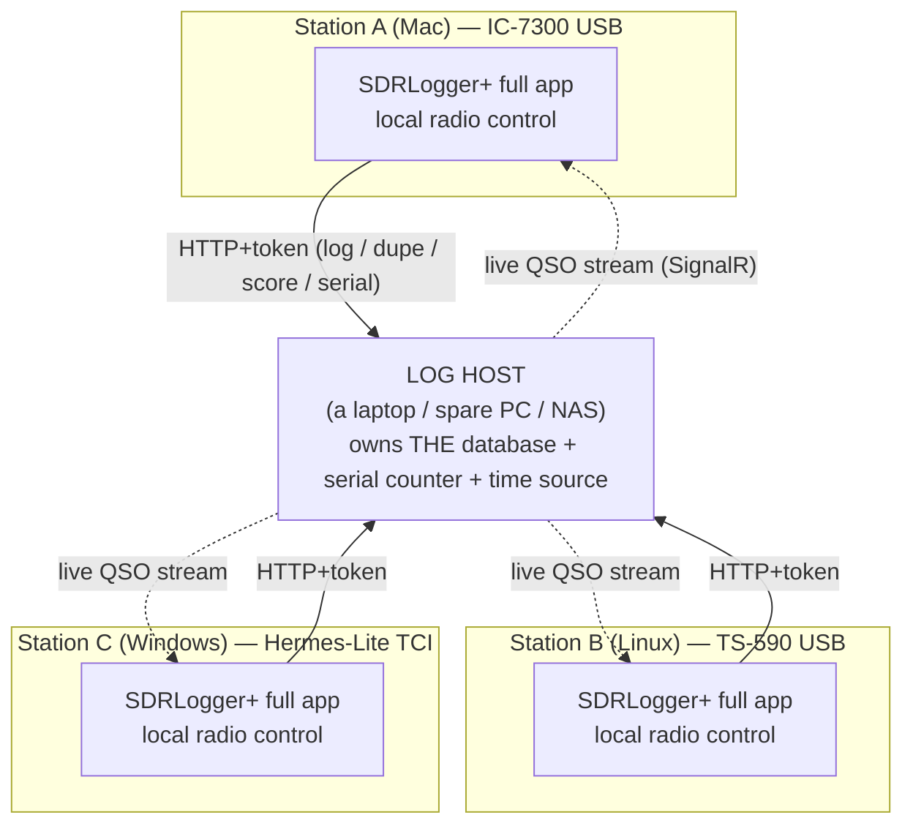
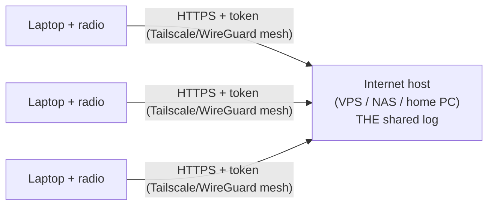

# Multi-operator networked logging — design & build plan

**Companion to** [`networked-shared-database.md`](networked-shared-database.md) (background/research).
This is the authoritative build plan. **Model corrected 2026-07-27** from an earlier "thin browser
client" framing to the **log-host** model below, after walking the real Field-Day what-ifs with the
operator. Anchors re-verified against post-v2.10.0 code.

> **The one-line model:** every station runs the **full app driving its own local radio**; only the
> **log** is shared, by pointing each app's data layer at **one host** over the network. It's the
> **N3FJP/N1MM model minus its two weak spots** — no file/permission sharing (we use an authenticated
> HTTP API), and real auth (per-device tokens, already built).

---

## 1. The model (why it is this shape)

Field reality: 3 stations = 3 laptops, **each with its own USB/TCI radio** (e.g. A=IC-7300/USB,
B=TS-590/USB, C=Hermes-Lite/TCI). Radio control **must** stay on the laptop the rig is plugged into, so
each laptop runs a full backend. Therefore we do **not** share a backend — we share the **log**:

- **Radio is always local.** Unchanged per-laptop rig control.
- **The database is the only shared thing.** One machine is the **log host**; the others' apps read/write
  it over the network. No merging, no per-machine divergence — one log, many writers.
- **API-mediated, not file-shared.** The host exposes an HTTP API + token; clients never touch its disk.
  This is what makes mixed-OS trivial and kills the SMB/permission problems N3FJP has.

**WAN / Bill's case** is the same picture with the host on the internet (VPS / always-on PC) reached via
**Tailscale/WireGuard** (preferred — no public port) or a **TLS reverse proxy**:

---

## 2. Two host flavors (pick per scale — LiteDB first, Postgres later)

| | **Option 1 — central backend as data host** | **Option 2 — shared SQL (Postgres)** |
|---|---|---|
| Where the log lives | One SDRLogger+ backend's **LiteDB** (a laptop / spare PC / NAS) | A **Postgres** server (NAS/VPS) |
| Clients | Full apps whose **data layer targets the host's API** | Full apps whose backend connects **directly to Postgres** |
| Concurrency | Host's one process serializes writes → **~8 ops comfortable** | Native multi-writer → **15–20+** |
| Setup | Zero DB server — just designate a host | Stand up Postgres |
| Build cost | Reuses LiteDB + the v1.0 auth (small) | New repo + schema + migration (large) |
| **Verdict** | **First target** — covers your 3-station LAN *and* Bill's WAN | **Scale-up** when a big station outgrows Option 1 |

Both keep radios local. The seam that switches between them already exists: `IQsoRepository` +
`DatabaseProvider` (`DbServiceRegistration.cs`).

---

## 3. Cross-cutting design decisions (every what-if we walked)

- **Mixed OS is a non-issue.** HTTP, not file shares. A Linux host authenticates Windows/Mac clients;
  auth tokens are SHA-256 hashes (OS-portable, already built that way).
- **The only thing to configure is the host.** Host binds to the LAN (`0.0.0.0:port`) + one **firewall
  allow** on that port (Win prompt / Mac prompt / `ufw allow`). Clients allow nothing (outbound HTTP).
  Give the host a **static/reserved IP or hostname** so the client "Host" address never changes. **LAN =
  plain HTTP acceptable; WAN = TLS/Tailscale mandatory** (also required for the WebGL globe's secure context).
- **Unique QSO ID at creation** (`stationId + localSeq`, or a GUID). One decision that pays off three ways:
  outbox de-dup, multi-USB merge without double-counting, and never re-uploading a duplicate to QRZ/LoTW.
  **Retrofitting IDs later is painful — do it first.**
- **Host-authoritative time.** Do NOT trust three laptop clocks (no internet at Field Day → 30–90 s skew →
  broken dupes + Cabrillo cross-check busts). Host exposes `GET /api/time`; each client measures an
  **offset (SNTP-style)** and stamps QSOs as `local + offset` (all UTC). Show a **sync indicator + a
  warning** if a client clock is wildly off. Anchor the host to NTP/GPS when available for true UTC.
- **Client local replica + outbox (offline-first).** Each client keeps a cached copy of the log (so it can
  see + dupe-check when the host blips) and an **outbox** of its own un-acked QSOs (so a Wi-Fi drop or host
  death never loses a contact). Idempotent, keyed on the unique QSO ID.
- **Serials are host-allocated.** Single atomic counter(s) on the host per the contest's rule
  (station-wide / per-band / per-op — already modeled by `SerialMode`). Client **pre-reserves its next
  number** so it's on-screen *before* the caller answers (instant to speak) — a **hard reservation, not a
  preview**, so a faster op can't steal it. Effects: a shared sequence shows **per-op gaps** (normal);
  abandoned QSOs leave a gap (fine). Client holds a **small cushion** so a host blip doesn't leave an op
  without a number mid-QSO.
- **Shared event bus (not just a QSO stream).** The host's live SignalR channel carries everything the
  stations need to coordinate, not only new QSOs: **QSOs**, **serial reservations**, **radio presence**,
  and **operator messages**. One connection, richer payload — the same rails serve all of it.
- **Radio presence = band + mode only (no frequency).** Each app broadcasts `{station, operator, band,
  mode}` **only when band/mode changes** (not on VFO tuning) → minimal traffic. This drives (a) a live
  "who's on what" board and (b) the **RF-collision / desense warning** — critical for Field Day, where
  stations are feet apart and a nearby transmitter on the same band can desense or damage another's RX
  front end. **Two-tier severity, derived from band+mode alone** (mode fixes which band segment you're in,
  so it stands in for frequency separation):
  - **Same band + same mode = HARD warn** (most dangerous — same segment, closest in freq, e.g. two 20m
    USB rigs both in the phone segment). Copy: *"⚠ Watch out — X is also on 20m USB."*
  - **Same band + different mode = SOFT heads-up** (more forgiving — CW low-end vs phone high-end ≈ 100+
    kHz apart). Copy: *"Take care — X is on 20m CW."*
  Frequency is deliberately omitted — band+mode already gives both the one-Tx-per-band-mode rule check and
  the desense-severity tier, without VFO chatter on the wire.
- **Operator LAN messaging.** N3FJP-style op-to-op chat over the event bus (band changes, coordination).
  Small; rides the same channel.
- **Redundancy & failover (low-tech, split-brain-proof).**
  - Host: internal DB primary + **continuous per-QSO mirror to a USB drive** + periodic snapshot + rolling
    **ADIF** (universal recovery format).
  - Each client: local replica + outbox + **its own USB mirror + rolling ADIF** → every position carries a
    near-complete copy; worst case any single machine is missing only its last 1–2 un-propagated QSOs.
  - **Failover = pull the (powered-off, crash-consistent) host USB → plug into standby → it hosts → clients
    re-point (auto if host has a reserved IP) → outboxes flush.** Human-decided (no auto-promotion) → no
    split-brain. A **host-epoch** counter, bumped on promotion, makes a returning old host **stand down to a
    client** instead of forming a second brain. USB *is* the warm standby, on removable media.
  - **Best mitigation: put the host on a non-operating box** (spare PC / NAS / VPS) so it rarely fails.

---

## 4. Build stages (order, dependencies, acceptance)

**S0 — ✅ DONE: remote-access auth (v1.0).** Per-device tokens (SHA-256), off-localhost default-deny bind
guard, `TokenAuthMiddleware` gating `/api`+`/hubs`, CORS allow-list, `--auth-add-device` CLI. 1426 tests
green. Files under `Core/Security/`. *(Built 2026-07-27, not yet committed.)*

**S1 — Data-host mode (the core).** Let a full app send its logging/dupe/score to a remote host instead of
its own file.
- Add a **remote `IQsoRepository`** (`RemoteApiQsoRepository`) that calls the host's existing QSO API
  (endpoints already exist), selected by a new `DatabaseProvider.RemoteHost` + a configured host URL+token.
- **Settings → Server**: host URL + token + **Test** (`/api/health`); "This machine is the host" vs
  "Connect to a host". Client subscribes to the host's SignalR stream for live QSOs.
- *Accept:* Laptop B (own radio) logs a QSO that lands in Host A's log and appears live on A and C; B's
  dupe-check + score reflect all stations.

**S2 — Unique QSO IDs + idempotent writes.** Stamp every QSO with a stable id at creation; host write is
idempotent on it. *Accept:* re-sending the same QSO (retry/outbox flush) never creates a duplicate; two
USB copies merge with zero double-counts.

**S3 — Client replica + outbox (offline-first).** Local cache for read/dupe when host is unreachable;
transactional outbox for un-acked writes; auto-flush on reconnect. *Accept:* pull the host's network
mid-session → B keeps logging + dupe-checking locally → reconnect → everything syncs, nothing lost/dupted.

**S4 — Host-authoritative time.** `GET /api/time`; client offset sync + corrected UTC stamping; sync
indicator + skew warning. *Accept:* a client clock set 60 s off still logs QSOs within ~1 s of the host's
time; indicator shows the offset.

**S5 — Host-allocated serials.** Atomic reserve-ahead from the host per `SerialMode`; on-screen next number
pre-reserved (hard claim); small offline cushion. *Accept:* two clients running simultaneously never
receive the same serial; each op's next number is on screen before the caller answers; a host blip doesn't
strand an op mid-QSO.

**S6 — Redundancy & failover.** Host + client USB mirror (per-QSO append) + rolling ADIF; documented
pull-and-promote procedure; host-epoch guard. *Accept:* kill the host, pull its USB, promote the standby,
re-point clients, flush outboxes → full log intact; old host returning stands down as a client.

**S0.5 — Multi-op contest schema (schema-first, do BEFORE S1).** Add `ContestInfo.Operator` (who's at the
key) + `ContestInfo.LoggedByStation` (which position — also the multi-Tx tag); move `Qso.Id` minting to
**creation time on the client** (the idempotency key S2/S3 depend on). Additive/nullable — freezes the
record shape before the network transports it. *Accept:* a QSO carries operator + station; the id is
stable from the moment it's created, before it ever leaves the client.

**S-COORD — Live coordination on the event bus (HIGH — RF safety; after S1/S3).** Radio-presence heartbeat
(`band+mode` only, on change) → live "who's on what" board + **RF-collision/desense warning** (same
band+mode = hard warn; same band = soft heads-up). Plus **operator LAN messaging**. Depends only on the
shared event bus that S1 (host + SignalR) and S3 (replica/stream) establish. The desense warning protects
hardware, so it's not a "nicety" — it ships with the first usable multi-op build.

**S7 — (Scale-up, later) Postgres backend.** `PostgresQsoRepository` + sibling repos; `DatabaseProvider`
extension; migration path. Only when concurrent-write load demands it (see load-test gate).

**S8 — (Later) Cabrillo multi-op category + mult sharing.** `CATEGORY-OPERATOR: MULTI-OP` +
`CATEGORY-TRANSMITTER` (ONE/TWO/UNLIMITED) + full `OPERATORS:` list as session settings (session-level, no
record migration — safe to do late). Live needed/mult sharing so an op doesn't chase a dupe the other just
worked.

---

## 5. Gates carried forward
- **Load-test before promoting any operator count** — N SignalR clients × M writes/min against a headless
  host; publish the *measured* comfortable-ops number per backend (LiteDB vs Postgres), not a guess.
- **Cap the promise until hardened** — the current-release "single-station only" notices (landing page,
  wiki, in-app Help) stay until the multi-op path ships and is load-tested; then lift the cap to the
  measured number.

## 6. Open items to confirm before S1
1. **Host discovery/addressing** — reserved static IP vs `hostname.local` (mDNS) vs a manual "Host" field
   (recommend: manual field now + reserved-IP guidance; mDNS discovery later).
2. **S1 host store** — start on **LiteDB (Option 1)**; Postgres deferred to S7. (Confirmed direction.)

---

## 7. Status & next-session pick-up (updated 2026-07-28)

**Shipped:** the whole S1–S6 stack (backend + frontend) is built and **released as a pre-test / beta
feature in v2.11.0 "Deneb"** (2026-07-28). Multi-op is documented as early-testing everywhere (in-app
Help "Multi-op (Beta)", wiki `Contesting.md` + `Feature-Status.md` + `Home.md`, and the landing page card)
with report-to-GitHub/Discord. Single-station is unaffected (Settings → Server stays **Local**).

**Remaining before we lift the beta tag — tomorrow's pick-up list:**

1. **S5b — serial-number client integration** *(✅ Piece 1 + 2a DONE 2026-07-28; 2b optional)*
   > **Research verdict (2026-07-28, GitHub #52):** N1MM's own manual states *"Missing or duplicated serial
   > numbers in the log do not matter; what matters is that what is logged matches what was actually
   > sent."* Neither N1MM (replication + manual "set to highest+1" reset) nor N3FJP (shared file)
   > **hard-locks** serials — the shown number is a live preview that can bump. So **Piece 1 + 2a = "done"**
   > and match/exceed the reference tools; **2b (hard lock) is OPTIONAL**, beyond what any of them do.
   - **(1) ✅ Client→host routing.** `IHostSerialClient` (Local / Remote) swapped by provider in
     `DbServiceRegistration` (mirrors `IQsoRepository→RemoteApiQsoRepository`). `ContestSessionService`
     `AllocateSerialAsync`/`PeekSerialAsync` call the host `POST /api/data/serial/next|peek` in RemoteHost
     mode, with local fallback on a host blip. Backend `SharedSerialAllocator` + `SerialController` = S5a.
   - **(2a) ✅ Preview display.** `ContestService.BuildDisplayStateAsync` overlays the host's `/peek` onto
     the contest state's `NextSerial` in multi-op (inert on a local install). Live preview, N1MM-style.
   - **(2b) Hard reservation — OPTIONAL (was thought required).** Reserve-on-show / commit-on-log /
     release-on-clear so a shown number can't bump. Needs a reserve/commit/release lifecycle on
     `SharedSerialAllocator` (today only `Next`/`Peek`). Build ONLY if a real WPX multi-op crew asks —
     it would exceed N1MM/N3FJP. Tracked on #52.
   - Scope: only **CQ WPX** + **ARRL Sweepstakes** need shared serials. **Field Day uses no serial.** No
     sync/upload risk (contest-session data). Our host-atomic `Next` prevents dupes on the *logged*
     number — stricter than N1MM.

2. **Manual host-IP entry in "Host this log"** *(operator ask, 2026-07-28)*
   - Today `ServerController` auto-discovers LAN addresses and the UI only *displays*
     `http://<lan-ip>:<port>`. Make the advertised address **user-settable / overridable** — for a public
     IP, a Tailscale/VPN IP, or when auto-detect picks the wrong NIC. Frontend `ServerSection.tsx` host
     pane + persist on `UserConfig`. (It's the address clients dial, so it must not be display-only.)

3. **WAN reachability guidance** *(pairs with #2)*
   - Verified in code: the host binds Kestrel `0.0.0.0:5050` and clients make a **direct HTTP + SignalR**
     connection — there is **no** UPnP/auto-port-forward, **no** relay/rendezvous, **no** hole-punch, **no**
     tunnel, and the link is **plain HTTP (no TLS)**. So WAN does **not** "just work."
   - Add an **"Operating over the internet (WAN)"** subsection to wiki `Contesting.md` + in-app Help:
     **VPN / overlay (Tailscale / ZeroTier / WireGuard) = recommended** (no port-forward, encrypted, use the
     host's VPN IP just like LAN); port-forward + public IP (dyn-DNS) works but is **least safe — the device
     token is the only guard and the data is unencrypted**; or an HTTPS tunnel (Cloudflare / ngrok).

4. **Already done, riding the next release** — time-sync label fix (`395d3d2`: the note now follows the
   *selected* mode, not the live backend) and the landing-page Discord link (`3b58792`).

5. **Go-live gate** — real-hardware + load test (measure the comfortable op-count on LiteDB), then lift the
   "beta / early-testing" wording everywhere to the *measured* number (per §5).
